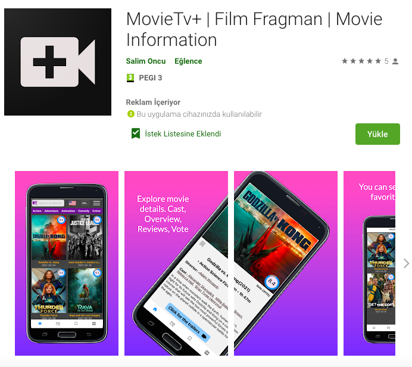

# movie-app-React-Native
This is an application of movie lists. You can find popular film, trends, upcoming, votes, informations, overview, review and trailers. 
Used components :
 
 
    "@react-native-async-storage/async-storage"
    "@react-native-community/masked-view"
    "@react-native-firebase/admob"
    "@react-native-firebase/app" 
    "@react-navigation/bottom-tabs"
    "@react-navigation/native"
    "@react-navigation/stack"
    "axios"
    "react-native-dom"
    "react-native-dotenv"
    "react-native-gesture-handler"
    "react-native-media-controls"
    "react-native-modal"
    "react-native-progress-circle"
    "react-native-reanimated"
    "react-native-safe-area-context"
    "react-native-screens"
    "react-native-slider"
    "react-native-vector-icons"
    "react-native-webview"
    "react-native-youtube-iframe"
    "react-redux"
    "redux"
    "redux-thunk"

  

